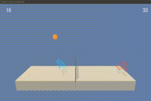

# DDPG Tennis

**DDPG Tennis** is a PyTorch project implementing a reinforcement learning 
agents controlling paddles in the *Tennis Environment*. 

In a **Tennis Environment**, agents control tennis paddles and try exchange a ball making as many 
passes as possible without letting it fall. 

Positive reward of 0.1 is awarded to an agent every time it touches the ball and sends it to the 
opposite side of the field. An episode terminates when the ball touches the ground. 

At episode termination, the max score collected by the 2 agents is considered as the overall score.
The environment is considered solved when an agents collect an average overall score > 0.5 (10 passes) over 
100 consecutive episodes. 

I used a custom variation of [Deep Deterministic Policy Gradients (DDPG)](https://arxiv.org/abs/1509.02971) to teach
agents collaboratively play tennis, here is an example:

More details on the file structure, implementation choices and parameters in Report.md
 
## Installation

In order to run the code in this project, you will need a python3.6 environment with the 
following packages:
- numpy
- matplotlib
- pickle
- torch

You will also need to install the Unity Tennis Envronment: 
- [Linux](https://s3-us-west-1.amazonaws.com/udacity-drlnd/P3/Tennis/Tennis_Linux.zip)
- [Mac](https://s3-us-west-1.amazonaws.com/udacity-drlnd/P3/Tennis/Tennis.app.zip)
- [Win_32](https://s3-us-west-1.amazonaws.com/udacity-drlnd/P3/Tennis/Tennis_Windows_x86.zip)
- [Win_64](https://s3-us-west-1.amazonaws.com/udacity-drlnd/P3/Tennis/Tennis_Windows_x86_64.zip)

## Usage

Run *inspect_SOLUTION.py* to test a single trained agent in action and measure its average performance over 100 
episodes. 

Run *ddpg_tennis_SOLUTION.py* to train the agent tested in *inspect_SOLUTION.py* 

More details on the file structure, implementation choices and parameters in Report.md