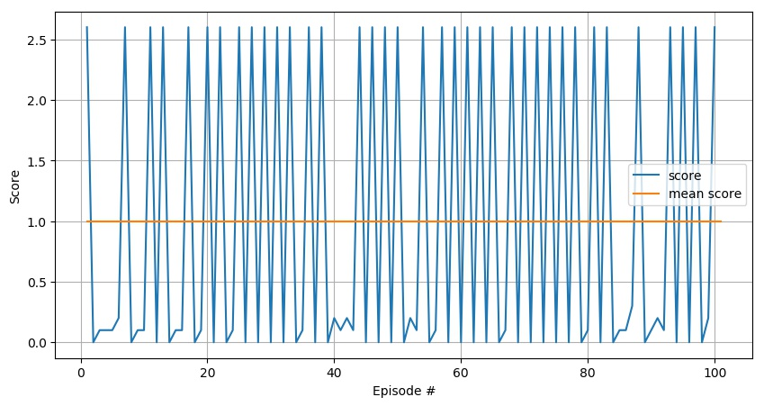

## Udacity Deep Reinforcement Learning Nanodegree
# Collaboration and Competition Project Report

### Learning Strategy

This project is a solution to the cooperative Tennis environment using  [Deep Deterministic Policy Gradients (DDPG)](https://arxiv.org/abs/1509.02971).  

Here is my trained ddpg agent in action

The the next chapter presents a short overview of DDPG, which can be seen as an adaptation of Deep Q-Networks to the case of 
countinuous action space.
For a very basic overview od DQN and of its building blocks, please refer the report for my previous projects [qnet_navigation](https://github.com/csggnn/qnet_navigation/blob/master/Report.md)
For a more detailed description of DDPG please refer to the orignial paper, or if you want to dig deeper into reinforcement learning consider the 
[Udacity Deep Reinforcement Learning Nanodegree](https://eu.udacity.com/course/deep-reinforcement-learning-nanodegree--nd893).

#### Intutition of Deep Deterministic Policy Gradients

**Deep Deterministic Policy Gradients** can be seen as an adaptation of DQN to the case of continuous action spaces.

In DQN a neural network is used as a function approximator of the representation of a Q function mapping each possible 
state in a continuous state space to set of Q values, one for each possible action. An agent feed a state observation to 
DQN and select the action corresponding to the highest Q value for that state.

If the action space is continuous, this approach no longer works, as a DQN can only produce a finite set of action value
 while the possible actions are infinite. 
 
DQN is a value method, it uses a neural network to model an action value function, producing an action value for each 
possible action in a state.
DDPG modifies DQN by using 2 networks: an actor network estimates the best action for an input state, while a critic 
network estimates the action value associated an input state, and the action selected by the actor.

The actor network uses the critic network to optimize its weights: weights are updated by gradient ascent, maximizing the
action value associated to the actions which the network would select for each state. This action value is obtained
from the critic network.

The critic network uses the action network as input, the action selected by the action network is fed as an input to the 
fully connected layers of the critic network which estimate the Q value associated to that specific action.
 
Experience replay is used as in DQN to decorrelate inputs: experiences, i.e. state-action-reward-new_state tuples 
observed by the agent are not directly used for training but are instead stored in a experience buffer. 
Learning occurs independently form actor's interaction with the environment, at every training itration a random batch of
experiences are drawn from experience memory. This approach has 2 main advantages:
- experiences can be used multiple times, speeding up learning
- experiences are no longer correlated in time, preventing instability

Differently for DQN, where probability values ase associated to possible actions DDPG algorithm is deterministic in its 
nature. Correlated noise is artificially added to action outputs in order to improve exploration.

Similarly to DQN, both the actor and the ctritic networks are doubled: each defines a local network which is actually 
trained, and a separated target network which is used for computing expected output. 

In its original formulation, the DQN local nework, used in training, is periodically copied over to the target network. 
Periodically updating its weights, the target network gradually improves its accuracy while still remaining decoupled
from the Local network and thus preventing instability.
Differently from DQN original algorithm, but similarly to some DQN implementations, DDPG uses soft target network updates.
After each update of the local networks (agent and critic), the target networks weights are updated as follows

**w_{target}=  (1-Tau) w_{target} + (Tau) w_{local}**

Where **Tau** is a soft update constant form 0 to 1 (typically low). The resulting target weights will be a temporally smoothed and delayed
vertion of the local networks weights. 

#### Tennis cooperative environment

In the Tennis environment, 2 agents are trained to bounce a ball, with the objective of keeping it in play
for as many exchanges as possible.

2 actions for 2 players must be provided to the tennis evironment at every timestep, and the tennis environment returns 
and observation, a reward and a game end boolean for each of the 2 players. 

##### Observation and State #####

The observation for each player is actually the stack of the 3 last measurements. The current measurement for a player 
is an 8-dimensional vector representing the position and speed of the own racket and of the ball in the 2D tennis space.
Although the very last measurement, which includes speed, would capture most of the relevant information, the redundancy
of this observation representation may be beneficial in mapping the constant acceleration of gravity and 
impacts between the rackets and the ball.

The terms Observation and State are often used interchangeably in an environment where the state can be fully observed.
In this environment, as there are 2 players, i refer to observation as to the set of information that an agent can 
observe, and to state as to the whole information on the current situation of the environment. In practice, 
the state of the environment includes the position and speed of both rackets, while the observation of each player only 
includes position and speed of one racket.

##### Collaborative training #####

Several algorithms can be trained on this collaborative task, some options are the following:

1. **A single agent with full state**. A single is fed with the ensemble of states (and possibly last actions) of both players, and jointly selects
the actions of both players. This can be done with a single actor-critic network, with same critic but separate actors, 
 or with separate networks which possibly share the experience buffer.
 I have discarded this option as I feel that feeding the observation of the opposite player goes against the 
 concept of the environment, which gives as output 2 separate observations for 2 players. With this option, the learned 
 agent would have the handicap of not being able to play without the opposite agent observations.  
 
2. **A single agent with separate observations**. A single agent can be trained and used to take actions for both 
players, having access to the observation of only one player at a time. 
The Agent can use the same actor critic network in both roles, and could chose to draw actions from 
the target actor network instead of from the local network for one of the two players. 
Although both players are used in training, the learned agent will only need to have access to the observations of a 
single agent in order to be able to play.

3. **Separate agents sharing information**. 2 separate agents can be trained, and these can share some common 
information. These could for example share the same experience buffer (or just have identical experience buffers) or 
even a common critic network, or perhaps just a common target critic network.

4. **Completely separate agents**. Training 2 completely separate ddpg agents is also an options although exploiting the 
information available from the interaction of the agents should be beneficial.

In my experiments, I have mainly explored using a single agent (option 2.), using the target actor network for one of the 
two players, and using separate agents with same experience buffer (option 3 shared experiences). 
My final solution is a combination of options 2, 3 and 4, using an "agent coach" as explained in the **Selected Custom 
Modifications** paragraph.

### Implementation

#### Project structure

 - **ddpg_tennis_SOLUTION.py** is the main file of the project. It is used to train a DDPG agent on the tennis 
    environment and includes several training improvement ideas.
    - A **Agent Coach** algorithm trying to stabilize learning by storing and reloading network state depending on
    score trend. The idea is to react to performance drop when performance drops, taking advantage of the ability of 
    saving agent checkpoints. This will be described further in the **Selected Custom Modifications** paragraph
    - an **epsilon greedy noise** approach. A very moderate correlated noise is added to actions to favour to balance
    exploration and exploitiation, but a strong additional noise would be added to some episodes with probability 
    noise_p, to prevent the agent from locking in a 0 reward state. The strong noise probability decays with time.
    - a **reward spread** mechanism to speed up training in a reward sparse environment. This will be described further in
     the **Custom Modifications** paragraph
     In the tennis environment 

    
 - **inspect_results.py** is the main file used to show the trained agent performance.
    A pair of agents can be loaded from saved checkpoints and tested on the TENNIS environment. 
    By default, **inspect_results.py** will load a pair of agents scoring on average >0.5 on the first 100 episodes of 
    TENNIS environmnent. This has been tested for seed options 0 and 1 as well as specifying no seed in my machine.
 - **linear_network.py** and  **critic_network.py** are customizable neural network configuration for actor (normal) and 
  critic (the additional action input can be fed at later layers). The most interesting feature is the ability of saving
   and loading a network to a checkpoint file, which includes not only the weights but also all the configuration 
   parameters 
 - **ddpg_agent.py**: Custom ddpg implementations including the following options:
   - [twin ddpg](https://spinningup.openai.com/en/latest/algorithms/td3.html]):
   a ddpg implementation which tries to address the possible overestimation of the Q function by the critic. 
   Twin ddpg uses 2 local and 2 target critic networks and uses the minimum among the Q values estimated by 
   the critic networks in training.
   - **lazy_actor** weight, adding cost to high action values in an attempt to obtain smoother, more natural playing 
   styles. This adds a positive term proportional to the action energy to the gradient computed in actor network 
   training.
 - **experience_replayer.py** the experience buffer used by the ddpg_agent, supporting a from of prioritized experience
   replay.
 
### Approach, Experimentation and Future Work

#### General Approach
In the previous assignments, I have learned to my expense that tuning a baseline solution and performing the minimum 
number of modifications is a much safer and direct strategy for getting to a solution than going towards a custom 
implementation.

Scientific papers such as [Deep Reinforcement Learning that Matters](https://arxiv.org/pdf/1709.06560.pdf) 
confirm my experience showing how performance in deep reinforcement learning is strongly affected by random seeding, 
specific implementation choices, hyperparameters. These aspects could easily outweight algorithm modifications 
in determining the overall score.

Despite this, as this is the last assignment, I have decided to implement my own ddpg solution and to experiment with 
several ideas and modifications. I felt like trying to implement algorithms and custom modifications would probably 
delay my delivery and expose me to risks but would force me to go deeper in the algorithm and understand it better.
 
Experiments i have conducted included:

- using the same agent for both players
- using the local actor to play against the target actor
- using separate agents with shared experiences
- adding noise in different magnitude and configurations
- implementing a twin ddpg algorithm 
- implamenting a *coach* algorithm to aggress instability and recover form performance
- testing 3 layer networks and and tiny networks
- stripping past observations from the observation vectors (using 8 dimensional observation vectors)
- (adaptively) modifying learning rate
- spreading reward among last experiences to reduce reward sparsity
- constraining actor gradient to obtain smoother actions
- experimenting with a number of other parameters of the neural networks.

#### Selected Custom Modifications

##### Reward spread

In the tennis environment reward is qite sparse, and in awarded with delay with respect to the action which is actually 
responsible for obtaining it. The player's actions resulting in the preparation, reception and stroke are all terminated 
before the ball makes it to the other side of the table, and he players actions in the few timesteps separating the 
stroke from the crossing have little to no influence on the overall score, but are instead the first to be  the reward, buimpacted by 
the positive reward and see their action values risen.
The high action value would eventually propagate to the state-action pairs which are actually responsible of the score 
but this may take a long time due to the sparsity of the reward. To speed this up I have introduced a reward spread 
algrithm.

A natural way to spread reward would be to low-pass filtering input reward values, so that part of the reward collected 
in the current episode is propagated to future episodes. This would reduce reward sparsity, but substantilally delay 
reward, would increment the separation between the reward and the actual state-action pairs which contribute to its 
achevement.

In order to reduce both with sparsity and delay, and input FIFO buffer is placed before the experience replay buffer. 
This buffer stores the last N experiences and speads reward observed in the most recent experience to the N previous 
experiences. At every new timestep, if the FIFO is full, a "modified-reward" experience tuple exits the FIFO and is fed
to the agent which will store it in its experience buffer. My final solution used N=3. Way larger experiments would be 
needed to understand the optimal value of N, which is thightly related to the actual environment.

##### Agent Coach

A main challenge in the use of ddpg algorithm is achieving stability. Many of my experiments showed points of high score
with gread instability, similarly to what is shown by the Benchmark Implementation, but to a much greater degree with 
the set of parameters I have tested.  

The pourpose of the **Agent Coach** algorithm is to reduce instability making the algorithm less dependent on 
selected parameters.

My final solution uses 2 ddpg agents with same parameters and architecture, and initially fed with the same 
experiences collected by both agents. The score of the 2 agents would rise when a local optimum is found and and then 
drop again, as the parameters of any of the agents get displaced from a local optimum. 

The **Agent Coach** detects and reacts to performance drop as follows:
- Whenever a new max score is reached, **Agent Coach**  creates a checkpoint holding the new *coach_last_score* (the 
new score max) and the state of both agents. The training rate is also slightly increased for both agents.
- When the performance drops beyond a portion of the saved *coach_last_score*, the **Agent Coach** replaces one of the current  
2 agents (selected at random) with one of the 2 agents (still selected at random) in the saved checkpoint. The training 
rate is also reduced for both agents. Additionally *coach_last_score* is slightly reduced for duture comparisons

Increments and decrements of training rate are designed to get to thigh training rate and fast solution on easy 
environments (where performance and training rate would just rise) and slower training rate on more difficult cases, 
which are more affected by instability.

The random selection of agents to be replaced provides means for widening the search space and dropping faulty agents
(the best combination will score a new top_score and get to a new checkpoint.) 

The final reduction of *coach_last_score* is needed as we want to avoid the agents from being locked on a possibly very 
low local maximum. This gradual score target drop provides a means from escaping from coach reloads and exploring a new 
solution if needed.

It should be noted that agents are saved and loaded together with their own experience replay buffers. 
While due to the training script configuration, the two agents would have an identical experience replay buffer, loading single agents 
from past checkpoints will result in different experience buffers. 

It should be also noted that when 2 consecutive performance drops occurr, and the 2 current agents are replaced with the 
same previous agents, these will not  result in identical agents, and the experience buffer and the weights of the first
replaced agent will have evolved before the other replaced agent is loaded. 

This agent coach configuration did improve performance (my previous results were nuch mure unstable) does not yet 
achieve the desired stability. Improvement of this technique, with possibly the addition of new agents, is part of Future 
work.

#### Solution Configuration

My final configuration solving the tennis environment is as follows:
 - I start with 2 separate ddpg agents having separate experience buffers and identical configuration but different seed for starting 
 weights and experience sampling. their parameters are as follows:
   - "vanilla" (no twin ddpg, no prioritized experience replay) 
   - Replay buffer size : 100.000 experiences, used only when at least 10.000 are stored
   - batch size : 128 samples
   - Gamma (discount factor) : 0.99
   - Tau (soft update of target network) : 0.02
   - Starting Learning Rate of Actor network : 0.0001 
   - Actor learning takes place every 2 critic learning calls.
   - Starting Learning Rate of Critic network : 0.0003
   - The network architechture for both actor and critic consists of 2 fully connected  hidden layers of size 400 and 300 
   each followed by leacky relu. Actions are fed to as input the second cully connected layer in the critic network.
      
 - The general training configuration is as follows:
   - Each Agent Learns from a batch of samples in the replay buffer after every 2 action iterations
   - Filtered gaussian noise with standard deviaton 0.5 is added to each action in an episode with probability decaying 
    from 1 to 0.001. This noise is meant to explore very different solutions where score is tuck to 0 or platoes.
   - Filtered gaussian noise with standard deviaton 0.02 is added to each action in all episodes. This noise is
    meant for local exploration.
   - Noise is added to the actions selected by the agents. These actions are clipped in valid range and then used to 
    interact with the environment and saved in the experience tuples fed to the agents for learning.
 
 - The **Agent Coach** algorithm interacts with learning every 25 episodes  as follows.
   - copmute average score of last 25 episodes (*score_25*) 
   - if *score_25* is 0.01 higher than *coach_last_score* (the "top score" up to now), update it with *score_25*, 
   increment learning rate by factor 1.03 and do a checkpoint of the 2 agents.
   - otherwise, if *score_25* went below 0.8 * *coach_last_score*, reload a random agent, reduce learning rate of all
   agents by factor 0.95 and reduce *coach_last_score* by factor of 0.9. (this last operation is needed so that)  
    

In the **delivery** release of this repository, ddpg_tennis_SOLUTION can be run to repeat training in the exact same 
configuration. 

#### Results

The following graph shows the evolution of score during training of my final agent pair. As shown, performance 
does drop after reaching a peak, but the peak is sufficently stable to achieve score well beyond 0.5 over 100
consecutive episodes.

I have selected the agent 2 in episode 10975 of my final configuration as the winning agent. 
To make sure the achieved score is not just due to a combination of episodes, I have tested this agent in
self play, showing an average performance close to 1 in 5 different 100 episode experiemnts.

**test seed=0**

**test seed=1**

**test seed=2**

**test seed=3**

**test seed=2**

The graphs highlight the agents qualities and flaws. The agent has a hard time at start, sometimes missing the
very first strike, but is very effective once the ball is in play easily getting to what i believe to be the score cap.

### Future Work

Some interesting algorithms, suct as the
[twin ddpg algorithm](https://spinningup.openai.com/en/latest/algorithms/td3.html]) and 
[Proritized experience replay](https://arxiv.org/abs/1511.05952) have been prototyped but not included in the final
solution. [Parameter noise](https://openai.com/blog/better-exploration-with-parameter-noise/) and gradient clipping are 2 additional features which seem promising for the solution 
of this environment but which i have not explored yet.
The main reason why all these algorithms have not been included in the final solution is that every additional algorithm 
requires a significant work of analysis, verification and parameter tuning, further incrementing the dimensionality o 
the papameter optimization. 

[Deep Reinforcement Learning that Matters](https://arxiv.org/pdf/1709.06560.pdf) shows how performance id deep reinforrcement 
learning is strongly affected by random seeding, specific implementation choices, hyperparameters. 
The findings of these paper are in line with my experience up to now: random seeding, specific implementation choices, 
hyperparameters can easily outweight algorithm modifications in determining the overall score, and most 
algorithm modifications are only effective with appropriate parameter tuning.

As a consequence, while tying to implement, experimenting and getting a feeling of different 
algorithm modification may be beneficial and interesting, in the interest of performance I expect greater benefits
to be achieved by parameter tuning and possibly verification of the implementation.

After parameters and implementation have been toroughly investigated, I would focusing on a single algorithm 
modification, as assessing the actual contribution of that single modification to algorithm performance is by itself a 
very complex task requiring full attention.

#### My choice

Two main challenge in deep reinforcement learning are strong parameter sensitivity and instability. 
Both of these challenges I have attempted to address with my **Agent Coach** algorithm with limited succes.

As future work, I would try to extend and improve on this algorithm on the following directions:
- Allowing the algorithm to control additional parameters, among which noise (parameter or action)
- Extending the algorithm to work on collaborative, competitive and single agent environments, using an 
  team on N>2 agents (with the idea of a coach substituting a player when its performance drops)
- Working on a released implementation of ddpg and on a standard set of environment, and setting up a coherent
  performance analysis framework to be able to actually evaluate the contribution of the algorithm to training.

